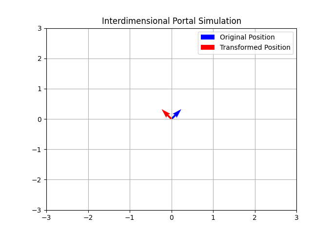

# Interdimensional Math 

- [x] Linear Algebra
- [ ] Calculus
- [ ] Multivariable Calculus
- [ ] Probability Theory

## Fundamentals of Linear Algebra

> "Linear algebra’s the backbone of all the cool crap in computer science—graphics, machine learning, simulations, all that jazz."

1. Vectors: **The Building Blocks of Everything**
    - **In Computer Science**: Vectors are used for positions, velocities, colors(RGB), and more. In graphics, they're your 3d models. In machine learning, they're your data points. Don't forget it.
    - **Operations**:
        - **Addition**: Add two vectors `(1,2) + (3,4) = (4,6)`
        - **Scalar Multiplication**: Multiply a vector by a number `2 * (1,2) = (2,4)`
        - **Dot Product**: For (1,2) and (3,4), it's `a * b = (1 * 3) + (2 * 4)`


2. Matrices: **Vectors on Steroids**
    - Matrices are just grids of numbers. Think of a bunch of vectors stacked together. A 2x3 matrix? That's 2 rows, 3 columns.
    - **In Computer Science**: Matrices are used for transformations in graphics (scaling, rotating, translating), neural networks (weights), and more.
    - **Operations**:
        - **Addition**: Same size matrices. Add them element by element. `(1,2;3,4) + (5,6;7,8) = (6,8;10,12)`
        - **Multiplication**: To multiply two matrices, the number of columns in the first has to match the number of rows in the second. 
        ```
        [1 2 3]   [7 8]     [1*7 + 2*9 + 3*11  1*8 + 2*10 + 3*12]
        [4 5 6] x [9 10]  = [4*7 + 5*9 + 6*11  4*8 + 5*10 + 6*12]
                [11 12]
        ```
    - **Transpose**: Flip the rows and columns. `(1,2:3,4)` becomes `(1,3; 2;4)`
    - **Identity Matrix**: A square matrix with 1s on the diagonal, 0s everywhere else. Magic, right? No, it's math.


3. Linear Transformations: **Bending Reality**
    - Matrices aren't *just* numbers. They're transformations. Multiply a vector by a matric, and you're stretching, rotating, or squishing space.
    - **Examples**:
        - **Scaling**: Multiply by a diagonal matrix, like `(2,0;0,2), to double the size.
        - **Rotation**: Use a rotation matrix. For 90 degrees in 2D, it's (0,-1;1,0).
        - **Translation**: In 3D graphics, use homogeneous coordinates. Add an extra 1 to your vector, like `(x,y,1)` and use a 3x3 matrix to move it around.


4. Determinants **and Inversees**: **The VIP of Matrices**
    - **Determinant**: Tells you if a matrix is invertible. For a 2x2 matrix `(a,b;c,d)`, it's `ad-bc`. If it's zero, the matrix is trash.
    - **Inverse**: The inverse matrix undoes what the original matrix did. If the determinant's zero, forget it--no inverse.

5. Eigenvectors and Eigenvalues: **The Secret Sauce**
    - The vectors that don't change direction when you transform them with a matrix. Shrinks and stretches (dimensionality reduction).
        - **Example**: For a matrix A, if A * v = λ * v, then v is an eigenvector, and λ is the eigenvalue. 

6. OK! Time to experiment with linear algebra and python. 
    - **Project: 2D Portal Simulator**:
        - You've got the basics. Now, let's build something cool--a 2D portal simulation. 
        - You'll use vectors for positions, matrices for transformations, and NumPy because we aren't doing this by hand. 
        - Goal: Simulate a portal that rotates and scales objects passing through it.

        **Step 1**: Run this in your terminal:
        ```bash
        pip install nympy
        ```

        > Know your tools &#8594; [NumPy: The Absolute Basics](https://numpy.org/doc/2.2/user/absolute_beginners.html)

        **Step 2**: Write the script. Simulate objects passing through a portal that rotates and scales them. Don't break space-time!

        **Step 3**: Plot the results. Play with the numbers. 
        
        